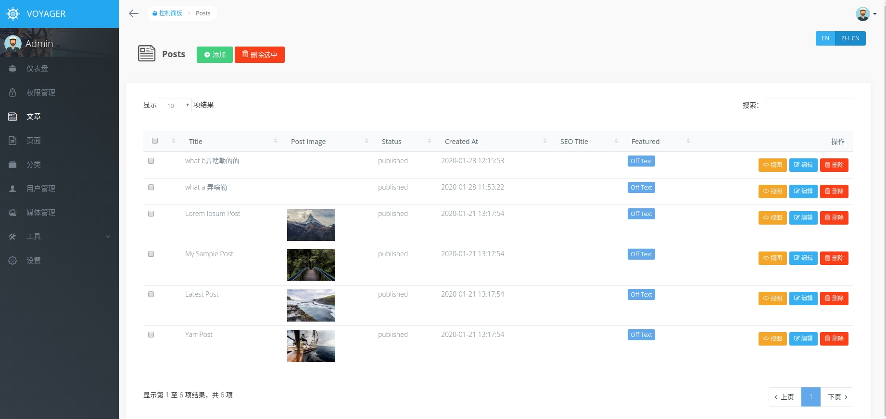

# voyager chinese lang plugin

voyager 中文语言包

## Requirement

1. PHP >= 7.2
2. Laravel >= 5.5
3. [**Voyager**](http://doc.laravel-voyager.cn/)

## Install hook

```bash
php artisan hook:install tu6ge/chinese-lang
```

## Enable hook

```bash
php artisan hook:enable tu6ge/chinese-lang
```

## Notice

在本hook启用期间，
不要修改菜单组`admin-zh-CN`的名字，也不要删除这个菜单组

## Priview


